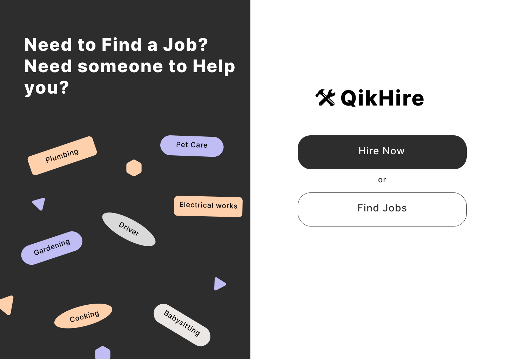
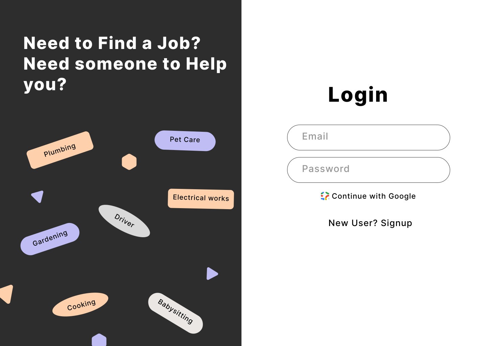
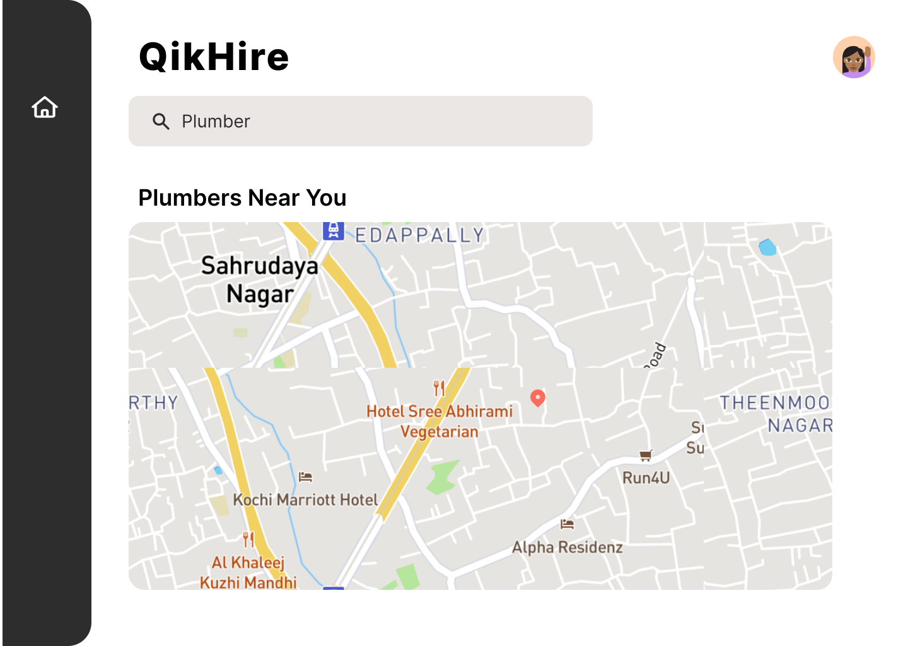
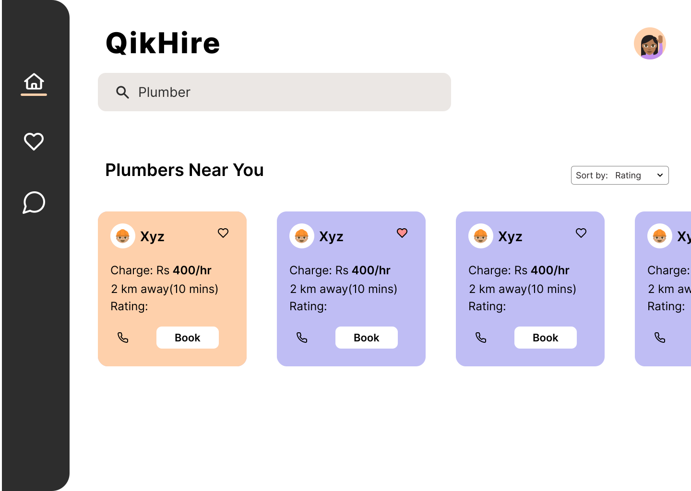
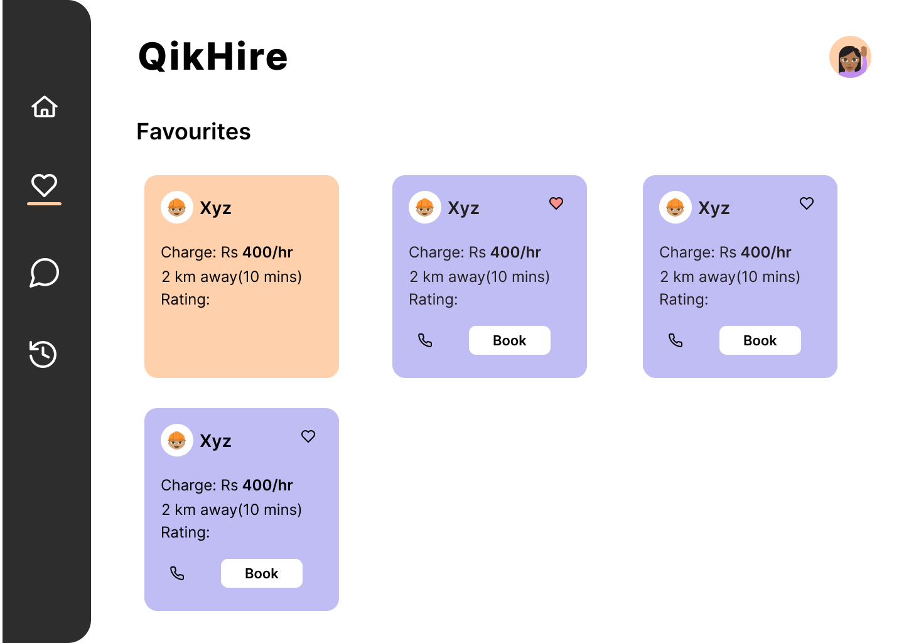
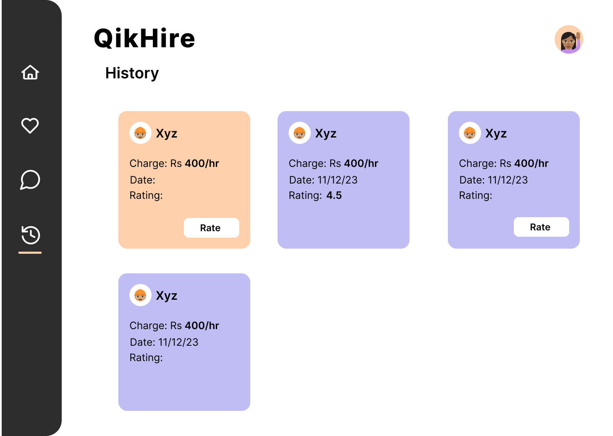
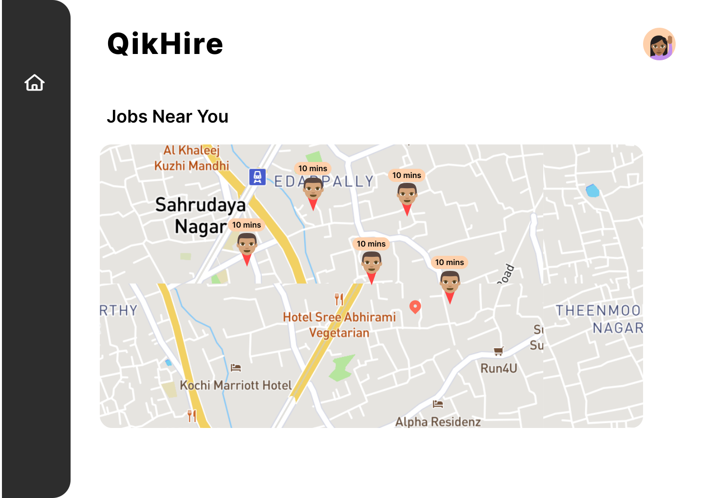
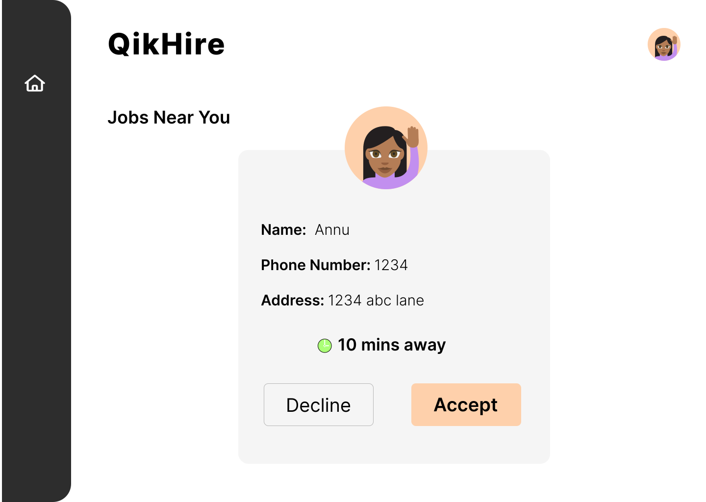
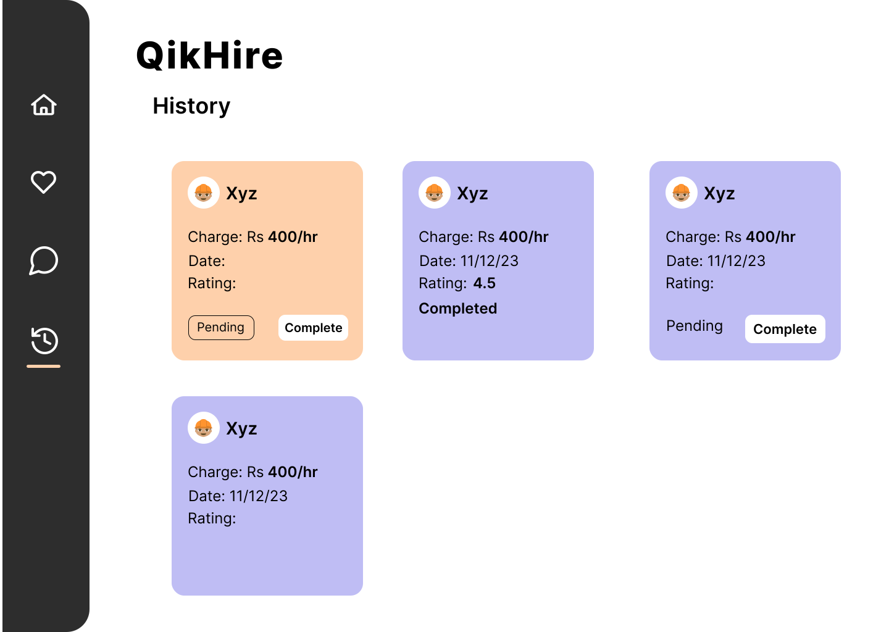
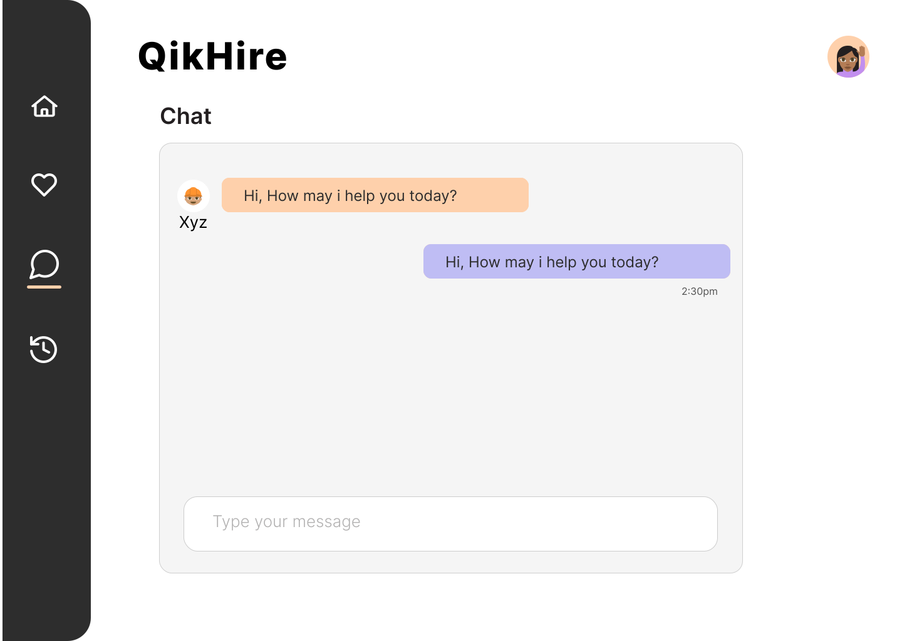

<h1>QikHire</h1>

QikHire is a website that allows the user to find and contact workers that provide essential / day to day services (ex: electricians, plumbers, repair
workers, painters, cooks and housemaids, carpenters, masons, coconut tree climber, etc.) Based on the type of service required, the website will show
available workers in their locality according to date and time of the user’s convenience.

<h2>Tech Stacks</h2>

NextJS, TailwindCSS, Firebase

<h2>Project UI</h2>

<h3>User view</h3>
<table>
  <tr>
     <td></td>
     <td></td>
  </tr>
  <tr>
     <td></td>
     <td></td>
    
  </tr>
  <tr>
     <td></td>
     <td></td>
  </tr>
 </table>

 <h3>Worker view</h3>
 <table>
  <tr>
     <td></td>
     <td></td>
  </tr>
  <tr>
     <td></td>
     <td></td>
    
  </tr>
 </table>

